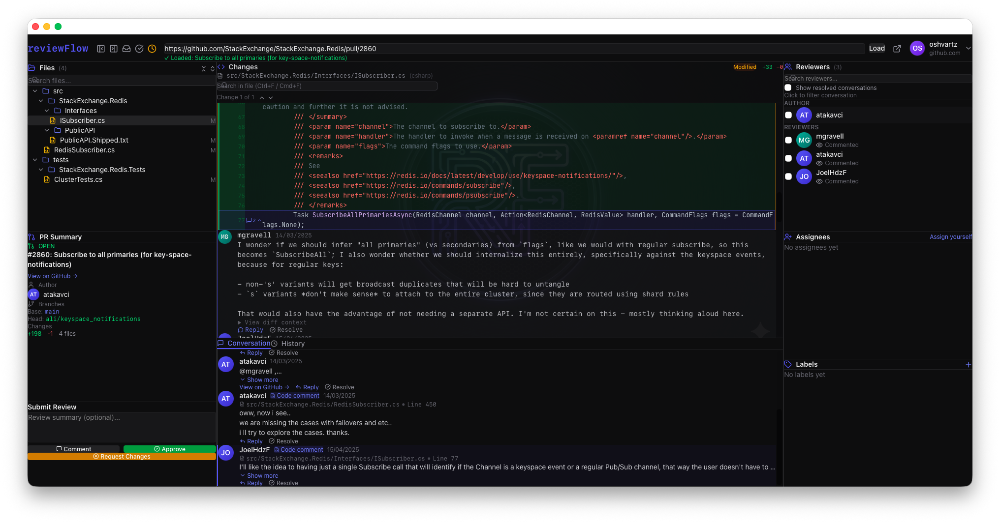

# reviewFlow

[](https://github.com/oshvartz/homebrew-reviewflow/releases)
[](https://github.com/oshvartz/homebrew-reviewflow/releases)

A client-side GitHub PR review tool with an IDE-like 4-pane layout. Runs as a native desktop app on macOS with an encrypted vault that stores your tokens behind a master password.

## Screenshots



## Features

- **4-Pane IDE Layout** — Resizable file explorer, diff viewer, conversation, and reviewers panels
- **Encrypted Vault** — AES-256-GCM encryption with Argon2 key derivation; unlocked with a master password
- **Multi-Host Support** — Store PAT tokens for multiple GitHub instances (github.com + Enterprise) in one vault
- **Persistent Login** — Vault auto-unlocks on app restart after entering your master password once
- **Diff Viewer** — Side-by-side diffs with syntax highlighting and inline commenting
- **Mermaid Diagrams** — Mermaid fenced code blocks in PR descriptions and comments render as interactive diagrams with zoom and pan
- **Extensionless File Support** — Diff viewer previews extensionless text files (e.g. `Makefile`, `Dockerfile`)
- **Reviewer Filtering** — Filter comments and history by contributor
- **Enterprise Support** — Works with GitHub.com and GitHub Enterprise
- **Deep links** — Open a PR in a new review window from Terminal, Automator, or other apps via the `reviewflow://` URL scheme (see [Deep links](#deep-links))

## Install + First Launch

The app is not notarized (no Apple Developer certificate), so run this once after install:

```bash
brew tap oshvartz/reviewflow
brew install --cask reviewflow
xattr -cr /Applications/reviewFlow.app
```

Then open **reviewFlow.app** from Applications (or Spotlight).

## First-Time Setup

### 1. Create Your Master Password

On first launch you are prompted to create a master password. This password encrypts your token vault — choose something you won't forget, as it cannot be recovered.

### 2. Add a GitHub Host and Token

1. Click **"Authorize"** in the top bar.
2. Enter your GitHub host:
   - `github.com` for public GitHub
   - `your.enterprise.host` for GitHub Enterprise
3. Enter your Personal Access Token (PAT) with `repo` scope.
4. Click **"Authenticate"**.

### 3. Load a Pull Request

Paste a full PR URL and press **Enter** or click **Load**:

```
https://github.com/owner/repo/pull/123
https://your.enterprise.host/org/repo/pull/456
```

## Deep links

reviewFlow registers the custom URL scheme **`reviewflow://`**. The `pr` query parameter must be a **URL-encoded** full PR URL (`https://…/pull/N` for GitHub or GitHub Enterprise).

### Open from Terminal

```bash
open 'reviewflow://open?pr=https%3A%2F%2Fgithub.com%2Forg%2Frepo%2Fpull%2F123'
```

Replace the encoded segment with your own PR URL (encode spaces and special characters), or build the URL in the shell, for example:

```bash
PR_URL='https://github.com/org/repo/pull/123'
ENC=$(python3 -c 'import urllib.parse,sys; print(urllib.parse.quote(sys.argv[1], safe=""))' "$PR_URL")
open "reviewflow://open?pr=${ENC}"
```

### Quick Action on macOS (Services)

Use a **Quick Action** so you can select a PR link in Safari, Slack, Mail, etc., and open it in reviewFlow.

1. Open **Automator** → **New Document** → **Quick Action** (on older macOS: **Service**).
2. Set **Workflow receives current** → **text** in **any application**.
3. Add **Run Shell Script** (Library → Utilities). Set shell to `/bin/bash` (or `/bin/zsh`) and **Pass input** → **as arguments**.
4. Paste:

```bash
PR_URL="$1"
if [[ -z "$PR_URL" ]]; then
  osascript -e 'display alert "No text selected" message "Select a GitHub PR URL first."'
  exit 1
fi
if ! [[ "$PR_URL" =~ https?://[^/]+/.+/[^/]+/pull/[0-9]+ ]]; then
  osascript -e 'display alert "Not a PR URL" message "Selection must look like https://host/org/repo/pull/123"'
  exit 1
fi
ENC=$(python3 -c 'import urllib.parse,sys; print(urllib.parse.quote(sys.argv[1], safe=""))' "$PR_URL")
open "reviewflow://open?pr=${ENC}"
```

5. Save (for example **Open in reviewFlow**).
6. Select a PR URL in any app → **right-click** → **Services** or **Quick Actions** → choose your saved action.

If you see **"No text selected"**, reopen the workflow and confirm **Workflow receives current** is **text** and **Pass input** is **as arguments** (not stdin).

**Notes:** Install the app and run it at least once so macOS registers the URL scheme. If the app shows the vault lock screen first, unlock the vault; the PR opens after the main UI is ready.

## Update

```bash
brew upgrade --cask reviewflow
```

## Uninstall

```bash
brew uninstall --cask reviewflow
brew untap oshvartz/reviewflow
```
